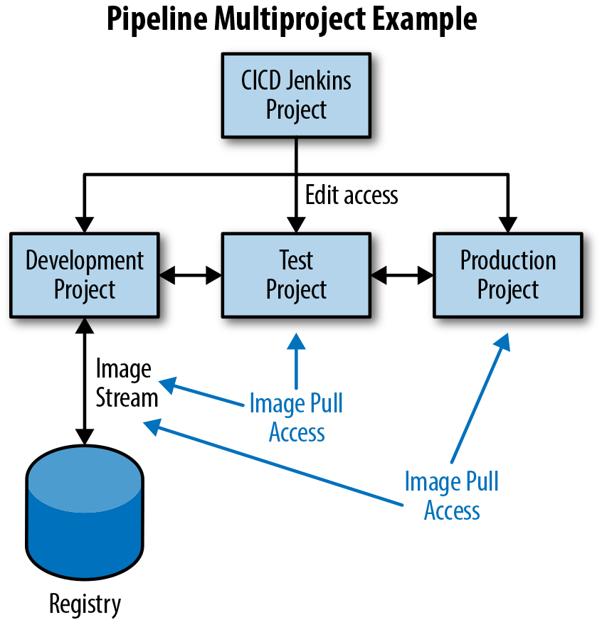
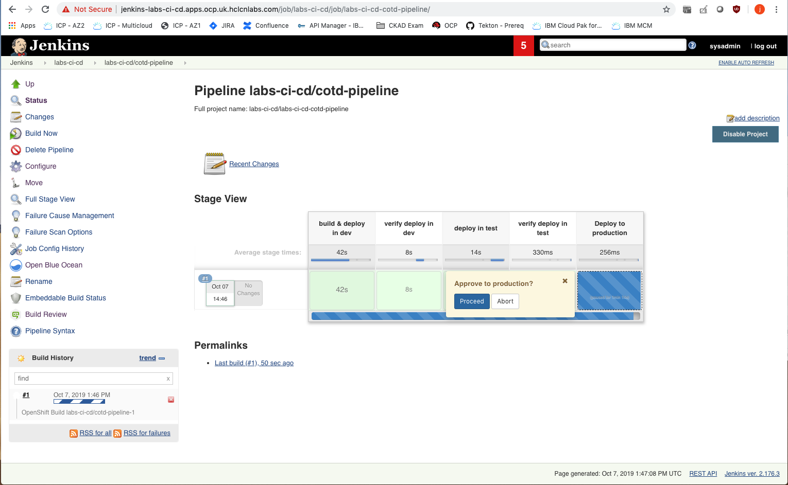
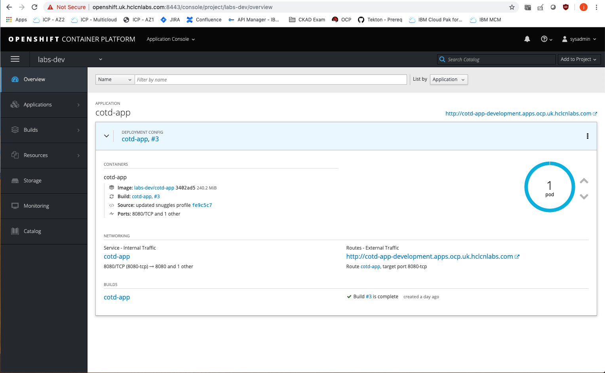
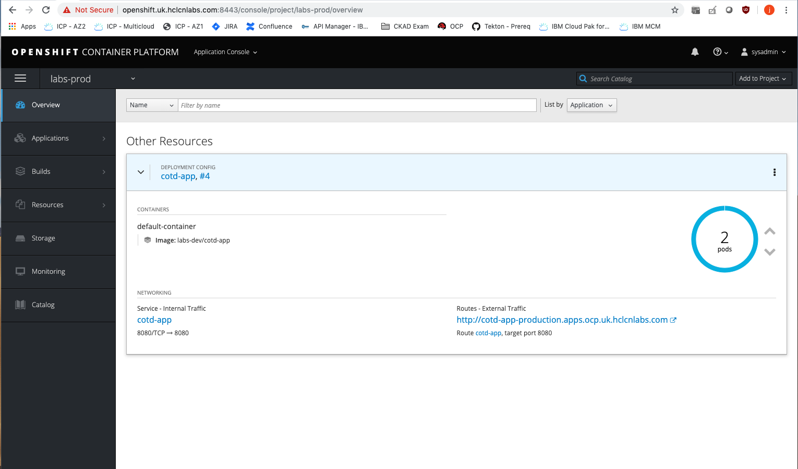
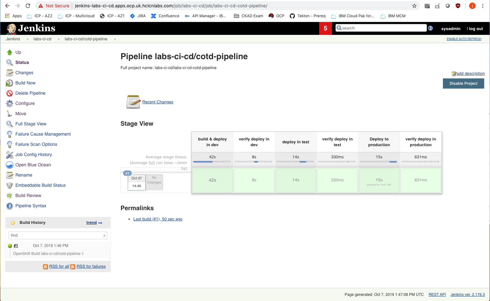
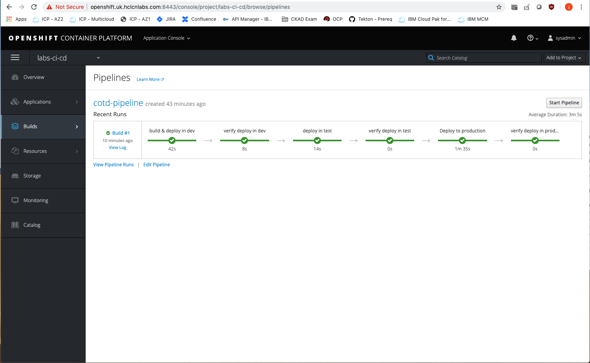
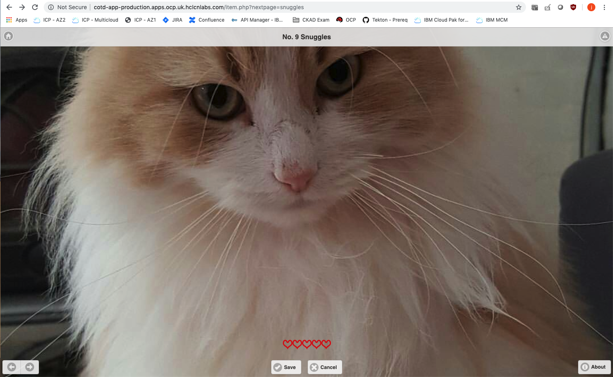

# Multiple Project Pipeline Example on OCP

This project demonstrates how to create a multi-project pipeline based on Redhat's [DevOps with Openshift book](https://www.oreilly.com/library/view/devops-with-openshift/9781491975954/ch04.html). The application used is a [sample PHP application](https://github.com/HCL-Cloud-Native-Labs/cotd).

Why do we want a multi-project pipeline?

"_-- In a software delivery lifecycle we want to separate out the different pipeline activities such as development, testing, and delivery into production. Within a single OpenShift PaaS cluster we can map these activities to projects. Different collaborating users and groups can access these different projects based on the role-based access control provided by the platform._"

The diagram below depicts the general form of our application flow through the various projects (development to testing to production) as well as the access requirements necessary between the projects to allow this flow to occur when using a build, tag, promote strategy.


## Prerequisites 

* Access to the OpenShift cluster
* [Jenkins](https://github.com/HCL-Cloud-Native-Labs/labs-ci-cd)
* [Projects created with associated Role-Based Access Control added on](https://github.com/HCL-Cloud-Native-Labs/labs-ci-cd)

## Basic Usage
Details about the significance of each of following steps can again be found in the [DevOps with Openshift book](https://www.oreilly.com/library/view/devops-with-openshift/9781491975954/ch04.html). Please go through it.

### Deploy pipeline definition 
1. Clone this repository.
2. Log on to an OpenShift server `oc login -u <user> https://<server>:<port>/`
3. Set project to `labs-ci-cd`:
```bash
$ oc project labs-ci-cd
```
4. Create pipeline itself using the following command
```bash
$ oc create -n labs-ci-cd -f pipeline.yaml
```

### Deploy sample application
1. Within `labs-dev` project, invoke new-app using the builder image and Git repository URL—remember to replace this with your Git repo. 
```bash
$ oc project labs-dev
$ oc new-app --name=cotd-app openshift/php:5.6~https://github.com/HCL-Cloud-Native-Labs/cotd.git#master
```
2. Create a route, replacing the hostname with something appropriate for your environment:
```bash
$ oc expose svc cotd-app --name=cotd-app --hostname=cotd-app-development.apps.ocp.uk.hclcnlabs.com
```
3. Create the deployment configuration in the `labs-test` project, making sure to use your own environment registry IP address.
```bash
$ oc project labs-test
$ oc create dc cotd-app --image=docker-registry.default.svc:5000/labs-dev/cotd-app:promoteQA
```
4. Update the imagePullPolicy for our container in so that we always trigger a deployment when we tag a new image:
```bash
$ oc patch dc cotd-app -p '{"spec":{"template":{"spec":{"containers":[{"name":"default-container","imagePullPolicy":"Always"}]}}}}'
```
5. Create service and route for the app, replacing the hostname with something appropriate for your environment:
```bash
$ oc expose dc cotd-app --port=8080
$ oc expose svc cotd-app --name=cotd-app --hostname=cotd-app-testing.apps.ocp.uk.hclcnlabs.com
```
6. Repeat these steps for the project `labs-prod`. Bearing in mind we are using two separate (arbitrary) image tags: `promoteQA` for testing promotion and `promotePRD` for production promotion.:
```bash
$ oc project labs-prod
$ oc create dc cotd-app --image=docker-registry.default.svc:5000/labs-dev/cotd-app:promotePRD
$ oc expose dc cotd-app --port=8080
$ oc expose svc cotd-app --name=cotd-app --hostname=cotd-app-production.apps.ocp.uk.hclcnlabs.com
```

### Run pipeline deployment
1. Run our pipeline deployment from the `labs-ci-cd` project:
```bash
$ oc start-build cotd-pipeline -n labs-ci-cd
```
2. See the pipeline build progressing in Jenkins within `labs-ci-cd` project. Access Jenkins by navigating to `Application Console → labs-ci-cd → Overview → Application: Jenkins → <jenkins url>`. Notice that the pipeline is paused waiting for user input:

3. Before proceeding, browse `labs-dev` and `labs-test` project to see that pods have been deployed and your application is up:


4. Select Proceed to allow the pipeline to continue to deploy to production.
5. Browse to `labs-prod` project and see that pods have been deployed and browse routes URL to see application:

6. See that the pipeline has finished:

7. Surprise! You can also see your entire pipeline process using the OCP web-ui within `labs-ci-cd` by navigating to `labs-ci-cd → Builds → Pipelines`

8. Notice that the application shows pets:


### Quickly deploying a new branch
1. Update your build configuration to build from a `feature` branch instead of a `master` branch:
```bash
$ oc project labs-dev
$ oc patch bc cotd-app -p '{"spec":{"source":{"git":{"ref":"feature"}}}}'
```
2. Start another build pipeline
```bash
$ oc start-build cotd-pipeline -n labs-ci-cd
```
3. Once finished, you should now see cities:


## Uninstalling

1. Delete the projects using the following commands:
```bash
$ oc delete project labs-ci-cd
$ oc delete project labs-dev
$ oc delete project labs-test
$ oc delete project labs-prod
```
2. Delete persistent volumes using the following command:
```bash
$ oc delete -f persistent-volume.yaml
```

